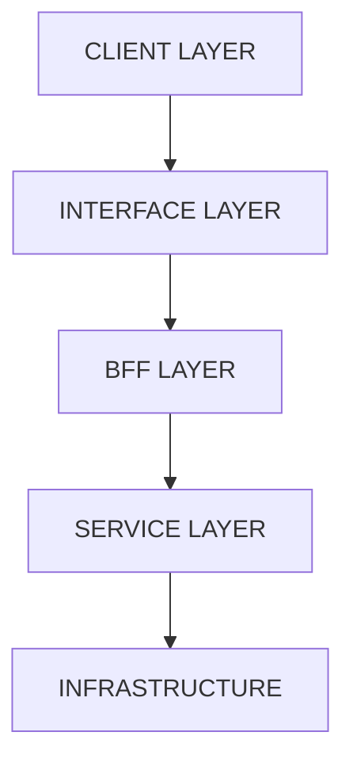
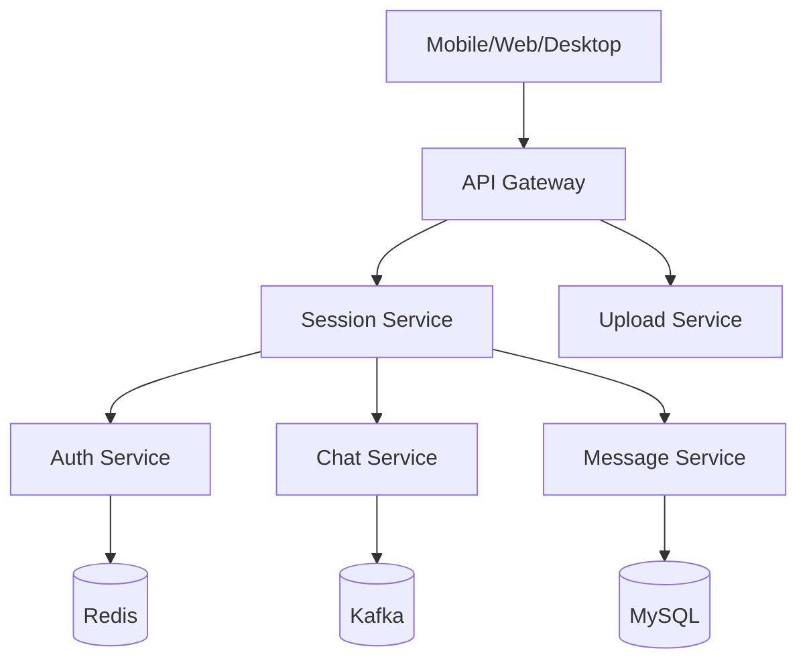

# ASCII Architecture Diagram AI Skill

## Overview

This skill focuses on:
- Designing system architecture using text
- Generating architecture diagrams with AI
- Writing technical documentation in terminal/CLI style
- Creating Git-friendly engineering documentation
- Building scalable architecture knowledge bases

Common names:
- ASCII Architecture Diagram
- Terminal-style System Design
- Monospace Architecture Visualization
- CLI Architecture Diagram

---

# When to Use

## Good Fit For

- Microservices architecture
- Distributed systems
- Backend platform documentation
- Engineering RFCs
- AI-generated documentation
- Git-friendly architecture docs
- Infrastructure topology
- Developer onboarding

## Not Ideal For

- Business presentations
- UI-heavy diagrams
- Complex BPMN workflows
- Enterprise UML modeling

---

# Core ASCII Skills

## Basic Box Drawing Characters

```txt
┌ ┐ └ ┘
│ ─
├ ┤ ┬ ┴ ┼
```

## Basic Service Box

```txt
┌──────────────────┐
│     SERVICE      │
└──────────────────┘
```

## Vertical Flow

```txt
CLIENT
   │
   ▼
SERVICE
```

---

# Standard Layered Architecture

```txt
┌──────────────────────┐
│     CLIENT LAYER     │
└──────────────────────┘
           │
           ▼
┌──────────────────────┐
│   INTERFACE LAYER    │
└──────────────────────┘
           │
           ▼
┌──────────────────────┐
│      BFF LAYER       │
└──────────────────────┘
           │
           ▼
┌──────────────────────┐
│    SERVICE LAYER     │
└──────────────────────┘
           │
           ▼
┌──────────────────────┐
│   INFRASTRUCTURE     │
└──────────────────────┘
```

---

# AI Prompt Engineering

## Generic Prompt Template

```txt
Generate a terminal-style ASCII architecture diagram.

Requirements:
- monospace layout
- box drawing characters
- layered architecture
- arrows between layers
- distributed system style
- dark terminal aesthetic

System:
- client layer
- api gateway
- bff services
- microservices
- databases and kafka
```

---

# Mermaid Diagram Skill

## Basic Mermaid Example



## AI Workflow Example

### User Prompt

```txt
Design architecture for chat system with websocket, auth, kafka and mysql
```

### AI Output



---

# D2 Language Skill

## Why D2 Is Powerful

Advantages:
- Excellent AI-generated output
- Clean automatic layouts
- Professional architecture diagrams
- Less verbose than Mermaid
- Great for microservices

## Example

```d2
client: CLIENT LAYER
interface: INTERFACE LAYER
bff: BFF LAYER
service: SERVICE LAYER
infra: INFRASTRUCTURE

client -> interface
interface -> bff
bff -> service
service -> infra
```

---

# Recommended Tools

| Tool | Purpose |
|---|---|
| Mermaid | Markdown diagrams |
| D2 | Architecture diagrams |
| asciiflow | ASCII diagrams |
| Obsidian | Knowledge base |
| Docusaurus | Engineering docs |
| MkDocs | Technical wiki |
| Excalidraw | Whiteboard diagrams |
| Cursor AI | AI-assisted documentation |

---

# Real-world Microservices Template

```txt
┌──────────────────────────────────────────┐
│              CLIENT LAYER                │
│       Mobile / Desktop / Web             │
└──────────────────────────────────────────┘
                     │
                     ▼
┌──────────────────────────────────────────┐
│            INTERFACE LAYER               │
│      Gateway / Routing / Upload          │
└──────────────────────────────────────────┘
                     │
                     ▼
┌──────────────────────────────────────────┐
│                BFF LAYER                 │
│       Auth / Users / Payments            │
└──────────────────────────────────────────┘
                     │
                     ▼
┌──────────────────────────────────────────┐
│             SERVICE LAYER                │
│       Core Domain Services               │
└──────────────────────────────────────────┘
                     │
                     ▼
┌──────────────────────────────────────────┐
│             INFRASTRUCTURE               │
│  MySQL / Redis / Kafka / Elasticsearch   │
└──────────────────────────────────────────┘
```

---

# Advanced Patterns

## Event-driven Architecture

```txt
SERVICE A
    │
    ▼
 KAFKA TOPIC
    │
    ▼
SERVICE B
```

## CQRS

```txt
CLIENT
  │
  ├── WRITE API ──► COMMAND SERVICE
  │
  └── READ API ──► QUERY SERVICE
```

## Hexagonal Architecture

```txt
┌──────────────────────┐
│      ADAPTERS        │
├──────────────────────┤
│       DOMAIN         │
├──────────────────────┤
│       PORTS          │
└──────────────────────┘
```

---

# Git-friendly Documentation

## Why Engineers Prefer This

### Readable Git Diff

```diff
- Payment Service
+ Payment + Billing Service
```

### Additional Benefits

- Easier merge conflict resolution
- AI editable
- No binary files
- Easy code review
- Works inside README files

---

# Best Practices

## DO

- Keep layer naming consistent
- Use monospace fonts
- Keep diagrams symmetric
- Group related services
- Show data flow clearly
- Place infrastructure at the bottom

## DON'T

- Overcrowd diagrams
- Add too many arrows
- Mix abstraction levels
- Use inconsistent spacing
- Put business logic in infrastructure layers

---

# Recommended Engineering Wiki Stack

```txt
Cursor AI
    +
Markdown
    +
Mermaid/D2
    +
Obsidian/Docusaurus
```

---

# Senior-level AI Prompt

```txt
Act as a senior distributed systems architect.

Generate:
- terminal-style architecture diagram
- markdown formatted
- layered architecture
- microservices decomposition
- infrastructure dependencies
- event flow
- gateway and bff layers

Use:
- monospace formatting
- ASCII box drawing
- concise labels
- clean alignment

Architecture style:
- scalable
- production-ready
- cloud-native
- event-driven
```

---

# Related Skills To Learn

- Event-driven architecture
- Distributed systems
- Domain-driven design (DDD)
- C4 model
- Sequence diagrams
- Infrastructure topology
- Kubernetes architecture
- Service mesh
- Kafka topology
- API Gateway pattern
- Backend-for-Frontend (BFF)

---

# Summary

This documentation style is powerful because:

- AI generates it quickly
- Git-friendly and maintainable
- Easy to review in pull requests
- Excellent for engineering culture
- No heavy diagram tools required
- Works perfectly in Markdown ecosystems

Widely used by:
- Startup engineering teams
- Platform teams
- Infrastructure teams
- Open-source projects
- AI-native engineering workflows

---

## Documentation Output Requirement (Mandatory)

After every skill run, always generate a markdown document.

Default output path:

```txt
.documentation/
└── <current-branch-name>/
    └── [AsciiArchitectureDiagram]<document-file-name-renegated>-<timestamp>.md
```

Rules:
- Must generate documentation after every run.
- Must use repository-root `/.documentation` as default base folder.
- Must separate files by current branch name.
- Must include renegated document file name plus timestamp in file name.
- Must use `.md` extension.

Timestamp format:

```txt
YYYY-MM-DD_HH-mm-ss
```
